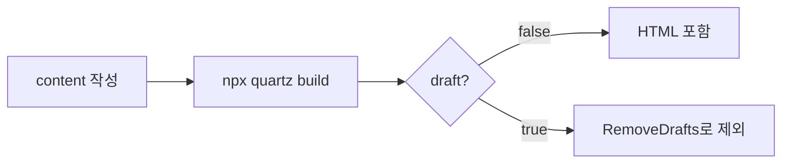
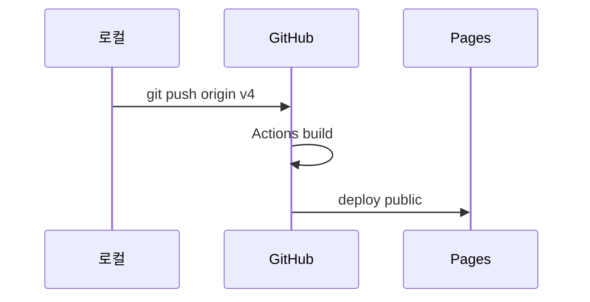

```mermaid
flowchart LR
  A[content 작성] --> B[npx quartz build]
  B --> C{draft?}
  C -->|false| D[HTML 포함]
  C -->|true| E[RemoveDrafts로 제외]
```

```mermaid
sequenceDiagram
  participant Dev as 로컬
  participant GH as GitHub
  participant Pages as Pages
  Dev->>GH: git push origin v4
  GH->>GH: Actions build
  GH->>Pages: deploy public
```

[허브](/테스트/)
